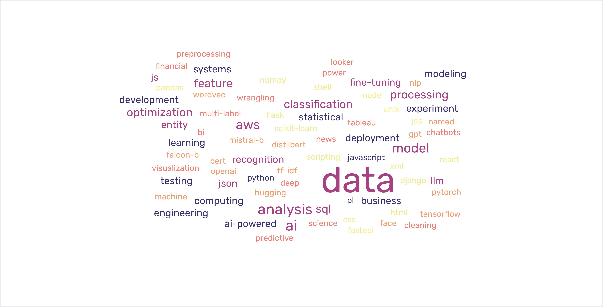

### Hi there 👋
<!--
**Rohituddagiri/Rohituddagiri** is a ✨ _special_ ✨ repository because its `README.md` (this file) appears on your GitHub profile.

Here are some ideas to get you started:

- 🔭 I’m currently working on ...
- 🌱 I’m currently learning ...
- 👯 I’m looking to collaborate on ...
- 🤔 I’m looking for help with ...
- 💬 Ask me about ...
- 📫 How to reach me: ...
- 😄 Pronouns: ...
- ⚡ Fun fact: ...
-->
# 💫 About Me:
Results-driven Data Analyst & AI/ML Engineer with expertise in data visualization, AI-powered analytics, and cloud-based solutions. Proficient in Python, SQL, Snowflake, Tableau, and Machine Learning, with hands-on experience in ETL pipelines, NLP models, and LLM fine-tuning to drive data-driven decision-making.

 

## 🌐 Socials:
 

# 💻 Tech Stack:
                     

### ✍️ Dev Quote

---

